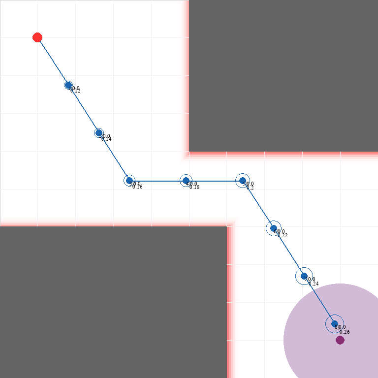

# Itomori: UAV Risk-aware Flight Environment
Gymnasium environment for research of UAVs and risk constraints.

Itomori is a custom environment for the Gymnasium library tailored for risk-aware UAV (Unmanned Aerial Vehicle) flight. Designed as part of a research project, Itomori provides tools to simulate, visualize, and evaluate UAV navigation in complex and risky environments, incorporating variables like GPS uncertainty, collision risk, and adaptive flight planning. Itomori is intended to support UAV path-planning research by offering adjustable parameters, detailed visualizations, and insights into agent behavior in uncertain environments.





## Key Features

- **Risk-aware Navigation**: Real-time risk assessment and adaptive flight planning based on GPS uncertainty and potential collision zones.
- **Detailed Visualization Tools**: Tools to display flight paths, collision risks, and decision-making trees, aiding in understanding UAV choices and route exploration.
- **Modular Design**: Compatible with the Gymnasium API, allowing for easy integration with reinforcement learning agents.
- **Customizable Parameters**: Adjustable settings for UAV dynamics, GPS uncertainty, velocity, and angle control to simulate various real-world conditions.

---

## Getting Started

These instructions will guide you through installing and running the Itomori environment locally.

### Prerequisites

- **Python 3.8+**
- **Conda**: Installation is recommended for managing dependencies.

### Installation

1. **Clone the Repository**

    ```bash
    git clone https://github.com/gustavo-moura/itomori.git
    cd itomori
    ```

2. **Create a Conda Environment**

    Create a new Conda environment for Itomori with the required dependencies.

    ```bash
    conda create --name itomori-env python=3.8
    conda activate itomori-env
    ```

    Or directly from the env yaml file


    ```bash
    conda env create -f environment.yml
    conda activate itomori-env
    ```

3. **Install Dependencies**

    Install the Gymnasium library and other dependencies using the `requirements.txt` file.

    ```bash
    pip install -r requirements.txt
    ```

4. **Install Itomori as a Gymnasium Environment**

    Register Itomori in the Gymnasium environment list.

    ```bash
    pip install -e .
    ```

### Verifying the Installation

Once installed, test Itomori by running a sample UAV navigation scenario:

```python
import gymnasium as gym
import itomori

# Initialize the environment
env = gym.make("Itomori-v0")
env.reset()

# Run a sample episode
done = False
while not done:
     action = env.action_space.sample()  # Replace with a trained policy for better results
     observation, reward, done, info = env.step(action)
     env.render()
```

---

## Environment Details

- **Action Space**: Continuous control of UAV velocity and angle.
- **Observation Space**: State observations include GPS position, heading angle, and estimated collision risk.
- **Reward Structure**: Rewards penalize collision risk and GPS uncertainty, encouraging agents to safely reach their destination.

### Visualization

Itomori includes tools for visualizing UAV paths, GPS uncertainty zones, and alternative flight paths in the decision tree. These tools help evaluate how agents navigate the environment and the influence of uncertainty on decision-making.

---

## Cite this project

```
@mastersthesis{gustavo2024ccmdp,
  title     = {Monte Carlo continuous action space solver for chance constrained Markov decision processes},
  author    = {Gustavo de Moura Souza and 
                    Claudio Fabiano Motta Toledo},
  year      = {2024},
  school    = {Universidade de São Paulo}
}
```

---

## Contributing

Contributions are welcome! Please feel free to submit issues, fork the project, and make pull requests.

---

## License

Itomori is licensed under the MIT License. See [LICENSE](LICENSE) for more information.

---

## Acknowledgments

This project was developed as part of a research dissertation to enhance UAV path-planning strategies and provide a robust framework for evaluating risk-aware flight algorithms.

---
